# PRD-to-Tasks Workflow for Claude Code + VibeKanban

A standardized workflow for managing development projects using Claude Code and VibeKanban MCP. This provides a set of global commands that help you go from PRD to tracked tasks with a living development plan.

## Overview

This workflow bridges the gap between product requirements and task management:

1. **PRD** (Product Requirements Document) defines what to build
2. **Development Plan** breaks it down into actionable, trackable tasks
3. **VibeKanban** tracks execution and progress
4. **Sync** keeps everything aligned

```mermaid
flowchart LR
    PRD[📄 PRD<br/>docs/prd.md] --> Review[🔍 /prd-review]
    Review --> Questions[❓ Clarifying<br/>Questions]
    Questions --> Answers[✅ User<br/>Answers]
    Answers --> Plan[📋 /create-plan]
    Plan --> DevPlan[📝 Development Plan<br/>with Epics]
    DevPlan --> Generate[⚡ /generate-tasks]
    Generate --> VK[📊 VibeKanban<br/>Tasks]
    VK <--> Sync[🔄 /sync-plan]
    Sync <--> DevPlan
    DevPlan --> Status[📈 /plan-status]
    DevPlan --> AddEpic[➕ /add-epic]
    DevPlan --> CloseEpic[✅ /close-epic]
```



## Commands

### Core Workflow

| Command | Description |
|---------|-------------|
| `/prd-review` | Analyze PRD, identify gaps, suggest epic breakdown, ask clarifying questions |
| `/create-plan` | Generate a structured development plan with epics from PRD |
| `/generate-tasks` | Create VibeKanban tasks from the development plan |
| `/sync-plan` | Synchronize plan with VibeKanban status (VK is source of truth) |

### Plan Management

| Command | Description |
|---------|-------------|
| `/plan-status` | Show progress summary without modifying files (read-only) |
| `/add-epic` | Add a new epic to an existing development plan |
| `/close-epic` | Mark an epic as complete after verifying all tasks are done |

## Detailed Workflow


## Installation

### Quick Install

```bash
# Clone the repo
git clone https://github.com/YOUR_USERNAME/claude-code-prd-workflow.git
cd claude-code-prd-workflow

# Run the install script
./install.sh
```

### Manual Install

Copy the commands to your Claude Code global commands directory:

```bash
# Create the commands directory if it doesn't exist
mkdir -p ~/.claude/commands

# Copy commands
cp commands/*.md ~/.claude/commands/
```

### Verify Installation

After installing, the commands should be available in any Claude Code session:

```bash
claude
# Then type: /prd-review
```

## Updating Commands

If you make changes to commands in this repo and want to apply them:

```bash
# Option 1: Re-run install script (will prompt before overwriting)
./install.sh

# Option 2: Force overwrite without prompts
./install.sh --force

# Option 3: Copy specific command
cp commands/sync-plan.md ~/.claude/commands/

# Option 4: Symlink for live updates (development mode)
./install.sh --link
```

### Overwrite Behavior

When files already exist in `~/.claude/commands/`, the installer will prompt:

```
⚠ File already exists: sync-plan.md (file)
Overwrite? [y]es / [n]o / [a]ll / [s]kip all:
```

- **y** - Overwrite this file
- **n** - Skip this file
- **a** - Overwrite all remaining files without prompting
- **s** - Skip all remaining files without prompting

Use `--force` or `-f` to skip all prompts and overwrite everything.

## Prerequisites

### VibeKanban MCP Server

You need VibeKanban MCP configured. See: [VibeKanban MCP Documentation](https://www.vibekanban.com/docs/integrations/vibe-kanban-mcp-server)

Add to your Claude Code MCP configuration:

```json
{
  "mcpServers": {
    "vibekanban": {
      "command": "npx",
      "args": ["-y", "@anthropic/vibekanban-mcp"]
    }
  }
}
```

### Project Structure

Your projects should follow this structure:

```
your-project/
├── docs/
│   ├── prd.md                  # Your PRD (input)
│   └── development-plan.md     # Generated plan (output)
├── src/
└── ...
```

## Development Plan Format

The development plan uses an **epic-based format** that enables hierarchical task tracking with progress percentages:

```markdown
# Development Plan: Project Name

> **Generated from:** docs/prd.md
> **Created:** 2024-01-22
> **Last synced:** 2024-01-22
> **Status:** Active Planning Document
> **VibeKanban Project ID:** abc-123-def

## Overview

Brief description of what we're building.

## Tech Stack

- **Backend:** Node.js, Express
- **Frontend:** React, TypeScript
- **Database:** PostgreSQL

---

## Completion Status Summary

| Epic | Status | Progress |
|------|--------|----------|
| 1. Foundation | Complete | 100% |
| 2. Core Features | In Progress | 50% |
| 3. Polish | Not Started | 0% |

---

## Epic 1: Foundation (COMPLETE)

Setting up the project infrastructure and dependencies.

### Acceptance Criteria

- [x] Project builds successfully
- [x] CI/CD pipeline runs on commits

### Tasks

| ID | Title | Description | Priority | Status |
|----|-------|-------------|----------|--------|
| 1.1 | Set up project structure | Initialize with folder structure | High | <!-- vk:abc123 --> |
| 1.2 | Configure CI/CD | GitHub Actions for testing | Medium | <!-- vk:def456 --> |

---

## Epic 2: Core Features (IN PROGRESS)

Implementing the main application functionality.

### Acceptance Criteria

- [ ] All API endpoints functional
- [ ] Unit test coverage > 80%

### Tasks

| ID | Title | Description | Priority | Status |
|----|-------|-------------|----------|--------|
| 2.1 | Implement auth | JWT-based authentication | High | <!-- vk:ghi789 --> |
| 2.2 | Add user API | CRUD operations for users | High | <!-- vk:jkl012 --> |

---

## Changelog

- **2024-01-22**: Initial development plan created from PRD
- **2024-01-23**: Epic 1 marked complete; Epic 2 started
```

### Key Format Elements

| Element | Purpose |
|---------|---------|
| `## Epic N: Name (STATUS)` | Epic header with status (NOT STARTED / IN PROGRESS / COMPLETE) |
| `### Acceptance Criteria` | Checkable criteria for epic completion |
| Task table with ID | Hierarchical ID (Epic.Task, e.g., 1.1, 2.3) |
| `Priority` column | High / Medium / Low task priority |
| `<!-- vk:ID -->` | VibeKanban task ID for syncing |
| `## Completion Status Summary` | Dashboard table showing all epic progress |
| `## Changelog` | History of plan updates |

## Sync Behavior


**Source of Truth:** VibeKanban status always wins during sync. This ensures the plan reflects actual work status.

## Customization

### Changing Plan Location

Edit `commands/create-plan.md` and `commands/sync-plan.md` to change from `docs/development-plan.md` to your preferred location.

### Adding Epics

The default epics in `/create-plan` are:
1. Foundation/Setup
2. Core Features
3. Supporting Features
4. Polish & UX
5. Testing & Documentation

Modify `commands/create-plan.md` to adjust these for your workflow. You can also use `/add-epic` to add new epics to an existing plan.

### Custom Task Fields

If VibeKanban supports additional fields (priority, labels, etc.), you can extend the `<!-- vk:ID -->` format:

```markdown
- [ ] **Task** <!-- vk:abc123 priority:high label:backend -->
```

And update the commands to parse/generate these.

## Troubleshooting

### Commands not appearing

1. Ensure commands are in `~/.claude/commands/`
2. Restart Claude Code session
3. Check file permissions: `ls -la ~/.claude/commands/`

### VibeKanban connection issues

1. Verify MCP server is configured: `/mcp` in Claude Code
2. Check VibeKanban authentication
3. Ensure project exists in VibeKanban

### Tasks not syncing

1. Verify task IDs in plan match VibeKanban: `<!-- vk:ACTUAL_ID -->`
2. Run `/generate-tasks` to link unlinked tasks
3. Check VibeKanban project has the tasks

## Contributing

1. Fork this repository
2. Make changes to commands in `commands/`
3. Test with `./install.sh`
4. Submit a pull request

## License

MIT License - See [LICENSE](LICENSE) for details.

## Related

- [VibeKanban](https://www.vibekanban.com/) - Kanban board with AI agent support
- [Claude Code](https://claude.ai/claude-code) - Anthropic's CLI for Claude
- [MCP (Model Context Protocol)](https://modelcontextprotocol.io/) - Protocol for AI tool integration
