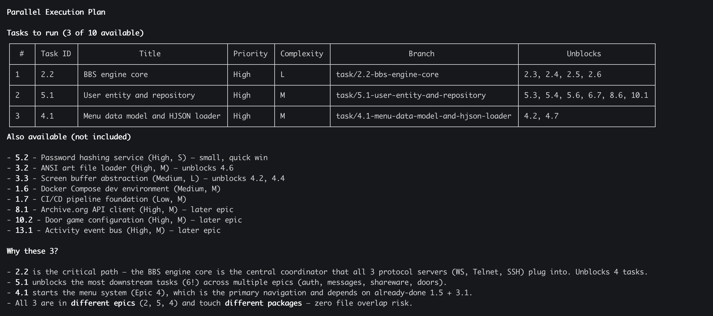
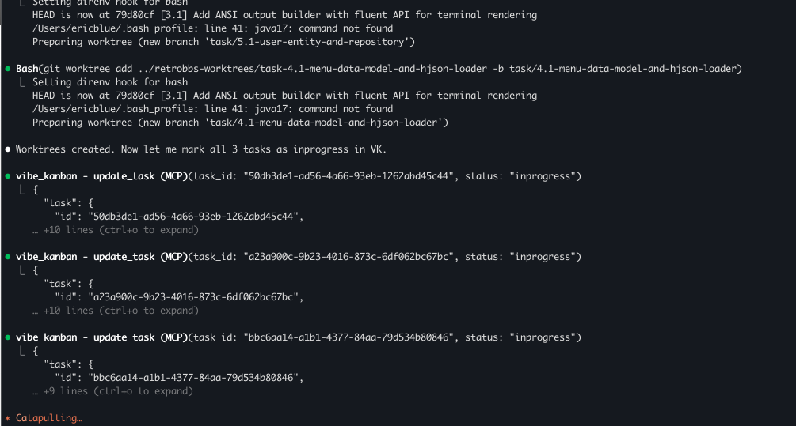
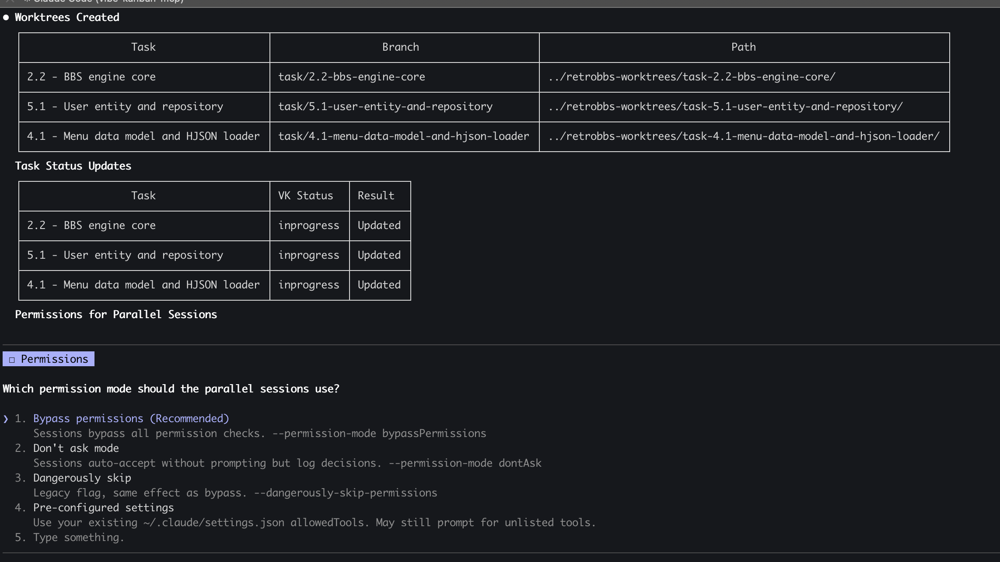
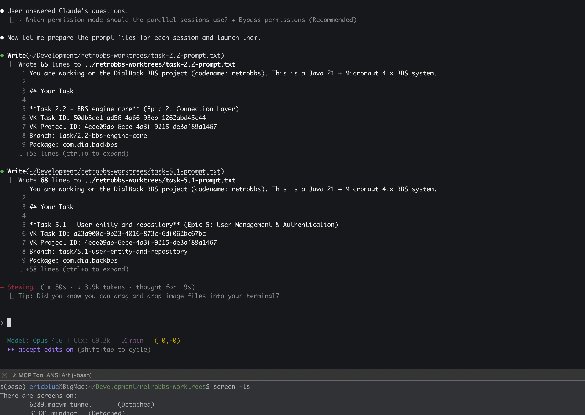
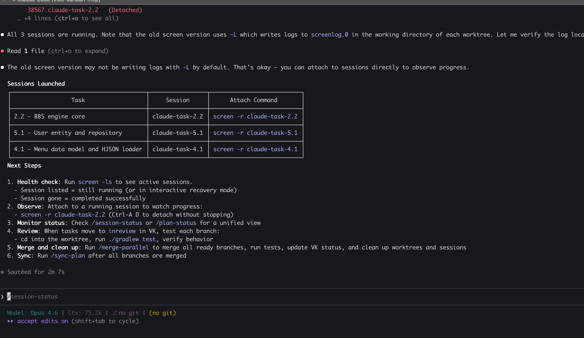
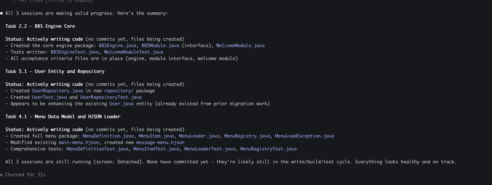
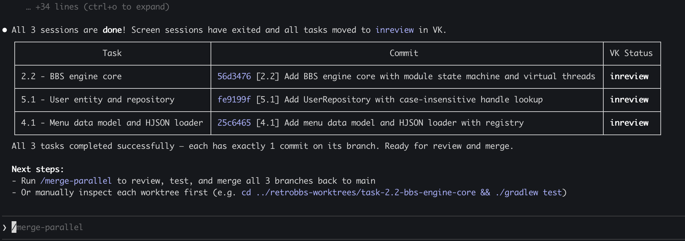
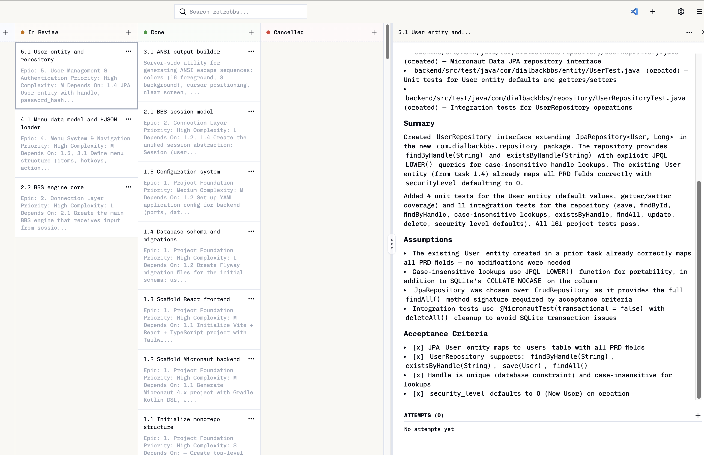
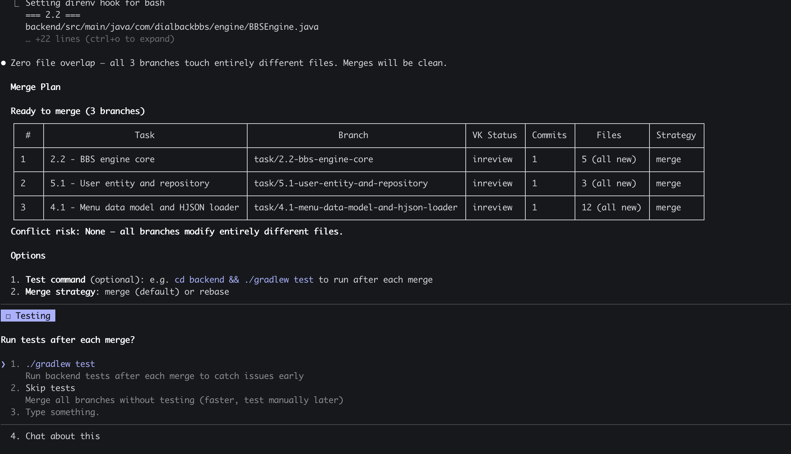

# Parallel Task Execution Walkthrough

> An example of the **Tier 1 (local) parallel execution** workflow — spawning multiple Claude Code agents on your machine, each working an independent task in its own git worktree, coordinated through VibeKanban.

> [!NOTE]
> This feature is **experimental**. Tier 1 (local parallel agents via git worktrees) is functional and demonstrated below. The next area of focus is **Tier 2 — delegating remote agents in parallel** via VibeKanban workspace sessions, enabling multi-agent execution across different coding agents (Cursor, Codex, Gemini, etc.).

## About This Example

The project used in this walkthrough is a retro-style BBS (bulletin board system) inspired by the dial-up BBSes of the early 90s. It's a work-in-progress built with a Java 21 / Micronaut 4.x backend and a Vite / React / TypeScript frontend. The project has multiple epics spanning protocol servers, menu systems, user management, and more — making it a good candidate for parallel task execution.

The three slash commands used in this workflow:
- **`/work-parallel`** — Analyze the backlog, create worktrees, launch parallel sessions
- **`/session-status`** — Monitor progress across all running sessions
- **`/merge-parallel`** — Merge completed branches back to main with testing and cleanup

---

## Step 1: Analyzing the Backlog (`/work-parallel`)



Running `/work-parallel` kicks off the analysis. Claude examines the full task backlog, evaluates priorities, dependencies, and complexity, then presents a **Parallel Execution Plan** — a table of tasks selected for concurrent work.

In this example, 3 out of 10 available tasks were selected:

| # | Task | Priority | Complexity | Branch |
|---|------|----------|------------|--------|
| 1 | 2.2 - BBS engine core | High | L | `task/2.2-bbs-engine-core` |
| 2 | 5.1 - User entity and repository | High | M | `task/5.1-user-entity-and-repository` |
| 3 | 4.1 - Menu data model and HJSON loader | High | L | `task/4.1-menu-data-model-and-hjson-loader` |

**Why these 3?** The agent explains its reasoning:
- **Task 2.2** is the critical path — the BBS engine core that all 3 protocol servers plug into. It unblocks 5 tasks.
- **Task 5.1** unblocks the most downstream tasks across multiple epics (auth, messages, shareware, doors).
- **Task 4.1** starts the menu system, which is the primary navigation layer.
- All 3 are in **different epics** and touch **different packages** — zero file overlap risk.

---

## Step 2: Creating Worktrees and Updating VK Status



Once you confirm the plan, Claude:

1. **Creates git worktrees** — each task gets its own isolated directory via `git worktree add`, with a dedicated branch
2. **Updates VibeKanban** — all 3 tasks are marked as `inprogress` via the MCP API

The worktree approach ensures complete file isolation between parallel agents — no merge conflicts from concurrent edits to the same files.

---

## Step 3: Worktree Summary and Permission Mode Selection



A summary table confirms the worktrees are created with their branches and paths:

| Task | Branch | Path |
|------|--------|------|
| 2.2 - BBS engine core | `task/2.2-bbs-engine-core` | `../retrobbs-worktrees/task-2.2-bbs-engine-core/` |
| 5.1 - User entity and repository | `task/5.1-user-entity-and-repository` | `../retrobbs-worktrees/task-5.1-user-entity-and-repository/` |
| 4.1 - Menu data model and HJSON loader | `task/4.1-menu-data-model-and-hjson-loader` | `../retrobbs-worktrees/task-4.1-menu-data-model-and-hjson-loader/` |

Claude then asks which **permission mode** the parallel sessions should use. Options include bypass permissions (recommended for autonomous operation), don't ask mode, or pre-configured settings.

---

## Step 4: Launching Parallel Sessions



After selecting permission mode, Claude:

1. **Writes detailed prompt files** for each task — these contain the full context including project description, task details, VK task IDs, branch names, package paths, and acceptance criteria
2. **Launches Claude Code sessions** inside `screen` — each agent gets its own terminal session running in the background

You can see prompt files being written (65-68 lines each) with structured context like:
```
## Your Task
**Task 2.2 - BBS engine core** (Epic 2: Connection Layer)
VK Task ID: 50db3de1-ad56-4a66-93eb-1262abd45c44
Branch: task/2.2-bbs-engine-core
Package: com.dialbackbbs
```

---

## Step 5: Sessions Running — Next Steps



All 3 sessions are now running in detached `screen` sessions. Claude provides a clear summary table and next steps:

| Task | Session | Attach Command |
|------|---------|----------------|
| 2.2 - BBS engine core | claude-task-2.2 | `screen -r claude-task-2.2` |
| 5.1 - User entity and repository | claude-task-5.1 | `screen -r claude-task-5.1` |
| 4.1 - Menu data model and HJSON loader | claude-task-4.1 | `screen -r claude-task-4.1` |

**Next Steps** provided:
1. **Health check:** Run `screen -ls` to see active sessions
2. **Observe:** Attach to any session to watch progress in real-time
3. **Monitor:** Use `/session-status` or `/plan-status` for a unified view
4. **Review:** When tasks move to `inreview` in VK, test each branch
5. **Merge:** Run `/merge-parallel` to merge all branches back to main
6. **Sync:** Run `/sync-plan` after branches are merged

---

## Step 6: Monitoring Progress (`/session-status`)



Running `/session-status` gives a unified view of all 3 sessions. Each task shows:

**Task 2.2 - BBS Engine Core** — Actively writing code (no commits yet, files being created)
- Created the core engine package: `BBSEngine.java`, `BBSModule.java` (interface), `WelcomeModule.java`
- Tests written: `BBSEngineTest.java`, `WelcomeModuleTest.java`
- All acceptance criteria files are in place

**Task 5.1 - User Entity and Repository** — Actively writing code
- Created `UserRepository.java` in new `repository/` package
- Created `UserTest.java` and `UserRepositoryTest.java`
- Enhancing the existing `User` entity

**Task 4.1 - Menu Data Model and HJSON Loader** — Actively writing code
- Created full menu package: `MenuDefinition.java`, `MenuItem.java`, `MenuLoader.java`, `MenuRegistry.java`
- Modified existing `main-menu.hjson`, created new `message-menu.hjson`
- Comprehensive tests written

All 3 sessions are still running (screen: Detached). Everything looks healthy and on track.

---

## Step 7: Sessions Complete — Ready for Review



All 3 sessions are **done**! Screen sessions have exited and all tasks have been moved to `inreview` in VibeKanban.

| Task | Commit | VK Status |
|------|--------|-----------|
| 2.2 - BBS engine core | `56d3476` - Add BBS engine core with module state machine and virtual threads | Inreview |
| 5.1 - User entity and repository | `fe9199f` - Add UserRepository with case-insensitive handle lookup | Inreview |
| 4.1 - Menu data model and HJSON loader | `25c6465` - Add menu data model and HJSON loader with registry | Inreview |

All 3 tasks completed successfully — each has exactly 1 commit on its branch. Ready for review and merge.

---

## Step 8: VibeKanban Board — Tasks in Review with Dev Notes



The VibeKanban board now shows all 3 tasks in the **In Review** column. Clicking into a task (e.g., "5.1 User entity and repository") reveals detailed dev notes that the agent wrote back to the ticket:

- **Files created** with descriptions
- **Summary** of the implementation approach
- **Assumptions** made during development
- **Acceptance Criteria** verification — showing which criteria are met

This creates a complete audit trail — anyone reviewing the work can see exactly what was done, why, and how it maps to the original requirements.

---

## Step 9: Merging Back to Main (`/merge-parallel`)



Running `/merge-parallel` analyzes all completed branches and presents a **Merge Plan**:

| # | Task | Branch | VK Status | Commits | Files | Strategy |
|---|------|--------|-----------|---------|-------|----------|
| 1 | 2.2 - BBS engine core | `task/2.2-bbs-engine-core` | inreview | 1 | 5 (all new) | merge |
| 2 | 5.1 - User entity and repository | `task/5.1-user-entity-and-repository` | inreview | 1 | 3 (all new) | merge |
| 3 | 4.1 - Menu data model and HJSON loader | `task/4.1-menu-data-model-and-hjson-loader` | inreview | 1 | 12 (all new) | merge |

**Conflict risk: None** — all branches modify entirely different files.

Claude offers to run tests after each merge (e.g., `./gradlew test`) to catch issues early, or skip tests for faster merging. The merge strategy is straightforward `merge` since there are no conflicts.

---

## Summary

The full parallel execution cycle:

```
/work-parallel    → Analyze backlog, create worktrees, launch agents
/session-status   → Monitor progress across all sessions
                  → Agents complete, update VK status to inreview
                  → Dev notes written back to VK tickets
/merge-parallel   → Merge all branches, run tests, clean up
```

**What makes this work:**
- **Dependency analysis** ensures only truly independent tasks run in parallel
- **Git worktrees** provide complete file isolation — no conflicts between agents
- **VibeKanban MCP** keeps the board in sync automatically as agents work
- **Structured prompts** give each agent full context (PRD, plan, acceptance criteria)
- **Human review gates** at key points — task selection, permission mode, merge strategy

The result: 3 complex tasks completed concurrently, each with clean commits, comprehensive tests, and detailed dev notes — all coordinated through a single terminal.
